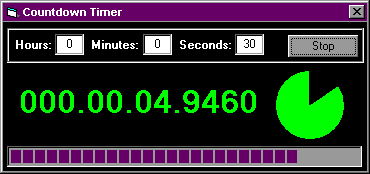



## Countdown Timer \- Tutorial for Asynchronous Processing

### Description

Countdown Timer is a complete application that demonstrates several very useful programming techniques.    

1. Asynchronous Processing  

The project includes a class called clsSlumber, which is an extremely useful tool for asynchronous processing. It encapsulates the Sleep API call, but slumbers in small intervals to allow your app to remain responsive to any trigger. clsSlumber will return control either when the slumber time expires or when it is told to wake up. This class is also accurate to 0.1 milliseconds in its timing capabilities, which is demonstrated in this timing accuracy of this app. For asynchronous processing, set the total slumber time to be your Timeout interval. If the processing is completed before the timeout, you can continue by Waking Up from the slumber, otherwise you can raise a timeout error when the slumber has completed. You will find this a very useful tool in you code collection, as I have used it broadly in my coding for over a year.    

2. OCX less Progress Bars  

Two examples of OCX-less Progress Bars are included, one is a standard progress bar, while the other is a Pie which fills in according to progress.   

3. Double Buffering  

Since this example displays updated time in 10 millisecond intervals, double buffering was necessary in order to provide a flicker-free display of the time.    

4. Error Handling  

The re-usable classes included in the project are great examples for error handling. Take note at how the call-stack will be returned in the error message that is raised.    

Although this application has very limited use, I hope you find the encapsulated utilities that are demonstrated here to be powerful tools for your future development. This code has been thoroughly tested on Windows 95, 98, NT 4, and 2000.    

Please don&#8217;t forget to vote!    

Thank you.    

David Drake
 
### More Info
 

             |
---                |---
**Submitted On**   |2001-01-02 10:56:56
**By**             |[David Drake](https://github.com/Planet-Source-Code/PSCIndex/blob/master/ByAuthor/david-drake.md)
**Level**          |Advanced
**User Rating**    |4.8 (125 globes from 26 users)
**Compatibility**  |VB 6\.0
**Category**       |[Complete Applications](https://github.com/Planet-Source-Code/PSCIndex/blob/master/ByCategory/complete-applications__1-27.md)
**World**          |[Visual Basic](https://github.com/Planet-Source-Code/PSCIndex/blob/master/ByWorld/visual-basic.md)
**Archive File**   |[CODE\_UPLOAD13285122001\.zip](https://github.com/Planet-Source-Code/david-drake-countdown-timer-tutorial-for-asynchronous-processing__1-14047/archive/master.zip)

